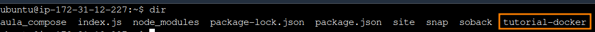
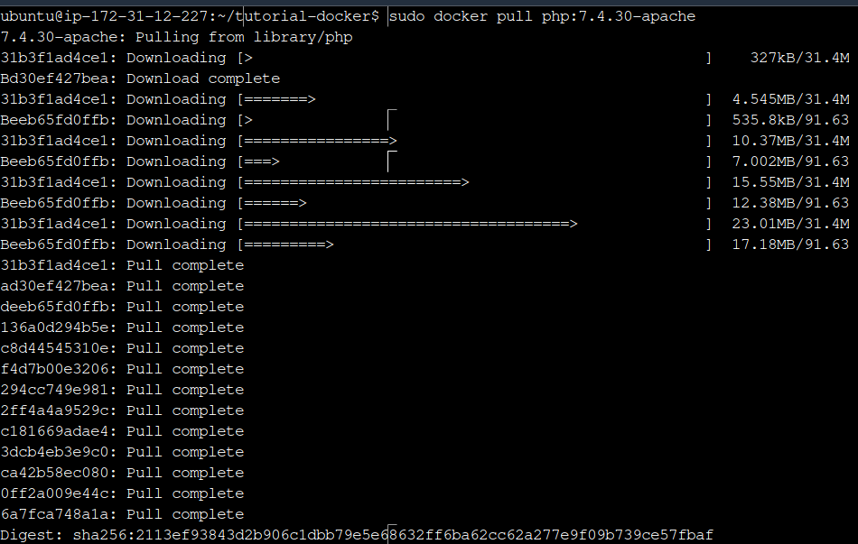
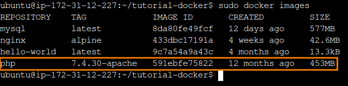
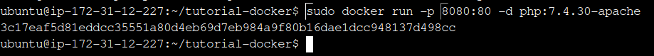
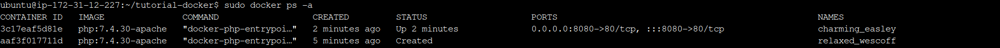
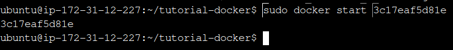

# tutorial-lab-so

Este repositório é um documento no formato de tutorial, ensinando a subir um container Docker com Apache + PHP.

# 1º Passo: Verificar se o Docker está instalado

Verifique se o Docker está instalado no seu sistema. Isso pode ser verificado digitando o seguinte comando no terminal:

```
docker -v
```

É esperado que retorne algo semelhante à isso:


# 2º Passo: Criar um diretório de trabalho

Crie um diretório para armazenar sua aplicação. Digite os seguites comandos no terminal com o nome de pasta da sua preferência:

```
mkdir nome-do-diretorio
```

Para verificar se foi criado corretamente, pode digitar no terminal:

```
dir
```

No meu caso, como eu já tenho outras pastas e instalações, aparece outros diretórios. Foque na última pasta na extrema direita da imagem. Essa pasta foi a que criamos (no seu caso pode ser outro nome, a depender do que você escolheu).



Para entrar na sua pasta, digite o seguinte comando:

```
cd nome-do-diretorio
```

# 3º Passo: Inserindo os arquivos PHP

Insira seu arquivo PHP (por exemplo, `index.php`) no diretório do projeto. Garanta que todos os arquivos necessários estejam presentes.

Para meu caso, utilizarei o seguite arquivo:

## index.php

```
<!DOCTYPE html>
<html>
<head>
    <title>My First PHP Project</title>
</head>
<body>
    <h1>Hello World!</h1>
    <?php
        // Este é um código PHP embutido que exibe a data e hora atual.
        echo "A data e hora atual são: " . date("d/m/Y H:i:s");
    ?>
</body>
</html>
```

## Criando o index.php

Digite o seguinte comando para criar e já abrir o arquivo para editar:

```
sudo nano index.php
```

Utilize `CTRL + SHIFT + V` para colocar o conteúdo desejado. Nesse caso eu coloqueo o código index.php acima.

Para salvar e sair, digite `CTRL + X` e em seguida confirme com `Y`

# 4º Passo: Baixando a imagem Docker do PHP e do Apache

Para baixar o PHP no Docker, vamos utilizar uma [imagem oficial do PHP](https://hub.docker.com/_/php), disponível no [Dockerhub](https://hub.docker.com/).

Utilizaremos o comando

`sudo docker pull php:7.4.30-apache`

porque, já na documentação no Dockerhub, existe essa imagem do PHP com o Apache.



Você pode listar as imagens Docker que possui na sua máquina utilizando o seguinte comando:

```
docker images
```



Em seguida criaremos e rodaremos o container do PHP e Apache no Docker:

Utilize o seguinte comando:

```
docker run -p 8080:80 -d php:7.4.30-apache
```

`-p` serve para definir a porta.

`-d` serve para definir o repositório e a tag da imagem desejada.



Listando os containers:

```
docker ps -a
```



Para executar o container, deve-se indicar o ID do container.

```
docker start IDCONTAINER
```



Caso queira finalizar:

```
docker stop IDCONTAINER
```

Para copiar os arquivos que criamos inicialmente para dentro do container, devemos utilizar o seguite comando:

```
sudo docker cp index.php 3c17eaf5d81e:/var/www/html
```

<!-- https://www.homehost.com.br/blog/tutoriais/como-instalar-php-e-apache-usando-docker/ -->
